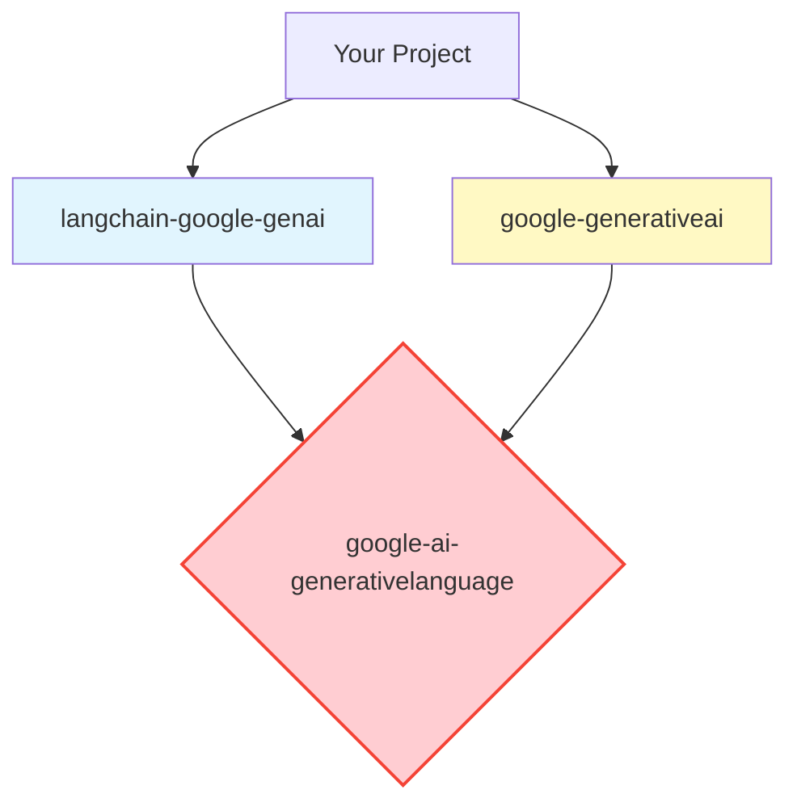

# Dependency Conflict Report

## The Core Issue: Diamond Dependency
This project faces a "Diamond Dependency" conflict where two top-level libraries require incompatible versions of the same underlying shared library (`google-ai-generativelanguage`).

### The Conflict Graph


### The Specific Error
When attempting to install both libraries in the same environment using `uv sync`, the resolver fails with this exact error:

```text
error: No solution found when resolving dependencies:
  Because google-generativeai>=0.8.4 depends on google-ai-generativelanguage==0.6.15
  and langchain-google-genai>=3.1.0 depends on google-ai-generativelanguage>=0.9.0,
  we can conclude that google-generativeai and langchain-google-genai>=3.1.0 are incompatible.
```

*   **Left Side:** `google-generativeai` (used for Nano Banana) demands version `0.6.15` exactly.
*   **Right Side:** `langchain-google-genai` (used for the Agent) demands version `0.9.0` or higher.
*   **Result:** It is mathematically impossible to satisfy both constraints in a single Python environment.

---

## Solution: The "No-SDK" Alternative (REST API)

You can bypass this entire conflict by **not installing `google-generativeai`**. Instead, use the standard Python `requests` library to call the Gemini API directly. This has **zero dependencies** on Google libraries.

### Python Code (Compatible with Main Pipeline)

Use this function in your tool instead of the SDK code.

```python
import os
import requests
import json
import base64

def process_image_rest_api(image_path, api_key):
    """
    Process image using Gemini 3 Pro via raw REST API.
    No google-generativeai dependency required!
    """
    url = f"https://generativelanguage.googleapis.com/v1beta/models/gemini-3-pro-image-preview:generateContent?key={api_key}"
    
    # 1. Read and Encode Image
    with open(image_path, "rb") as f:
        image_data = base64.b64encode(f.read()).decode("utf-8")
    
    # 2. Construct JSON Payload
    payload = {
        "contents": [{
            "parts": [
                {"text": "Isolate this object on a purely solid white background. Sharpen details. High quality texture."},
                {
                    "inline_data": {
                        "mime_type": "image/jpeg", # Adjust based on input
                        "data": image_data
                    }
                }
            ]
        }]
    }
    
    # 3. Send Request
    headers = {'Content-Type': 'application/json'}
    response = requests.post(url, headers=headers, data=json.dumps(payload))
    
    if response.status_code != 200:
        print(f"Error: {response.text}")
        return None
        
    # 4. Parse Response (Extract Image)
    try:
        result = response.json()
        # Navigate the JSON to find the inline_data
        # Note: The structure depends on the model response, usually in candidates[0].content.parts
        candidates = result.get("candidates", [])
        if candidates:
            parts = candidates[0].get("content", {}).get("parts", [])
            for part in parts:
                if "inline_data" in part:
                    return part["inline_data"]["data"] # Returns base64 string
    except Exception as e:
        print(f"Parsing error: {e}")
        
    return None

# Usage
# api_key = os.environ["NANO_API_KEY"]
# b64_result = process_image_rest_api("Mango.jpg", api_key)
# if b64_result:
#     with open("processed_Mango.png", "wb") as f:
#         f.write(base64.b64decode(b64_result))
```

### Why this works
*   `requests` is a standard library (or easily installed with no conflicts).
*   The API contract (JSON over HTTP) doesn't care what Python libraries you have installed.
*   This allows you to keep `langchain-google-genai` for your agent while still using Gemini 3 Pro for images.
